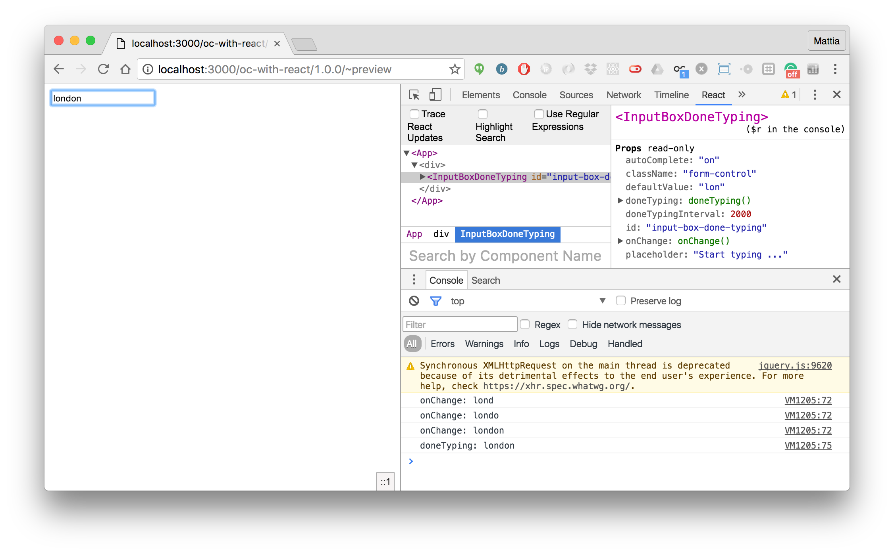

# oc-with-react

oc-with-react

```
npm i
npm run eslint
npm run webpack
npm run start
```

Then open the component's preview at the following url:

[http://localhost:3000/oc-with-react/1.0.0/~preview](http://localhost:3000/oc-with-react/1.0.0/~preview)



> If you open your browser's developer tools, you should be able to see console logs every time you type a letter into the input box (which means that the client side interaction w/ your React application works just fine).
